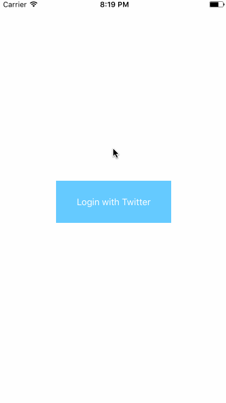

# CodePath-Twitter
This is an iOS application leveraging the Twitter API to display Tweets.

###Time spent: 12 hours

###Completed required user stories:

* [x] User can sign in using OAuth login flow
* [x] User can view last 20 tweets from their home timeline
* [x] The current signed in user will be persisted across restarts
* [x] Cells contents are laid out using Auto Layout
* [x] In the home timeline, user can view tweet with the user profile picture, username, tweet text, and timestamp. In other words, design the custom cell with the proper Auto Layout settings. You will also need to augment the model classes.
* [x] User can pull to refresh
* [x] User can compose a new tweet by tapping on a compose button.
* [x] User can tap on a tweet to view it, with controls to retweet, favorite, and reply.

###Completed optional user stories:

* [ ] When composing, you should have a countdown in the upper right for the tweet limit.
* [ ] After creating a new tweet, a user should be able to view it in the timeline immediately without refetching the timeline from the network.
* [x] Retweeting and favoriting should increment the retweet and favorite count.
* [ ] User should be able to unretweet and unfavorite and should decrement the retweet and favorite count. Refer to this guide for help on implementing unretweeting.
* [ ] Replies should be prefixed with the username and the reply_id should be set when posting the tweet
* [ ] User can load more tweets once they reach the bottom of the feed using infinite loading similar to the actual Twitter client.

###Notes:
There were some problems with the Twitter API not allowing POST requests to complete. Received a repeated 401 error and was unable to correct the problem. The walkthrough demonstrates the expected UI had the POST network calls actually worked.

