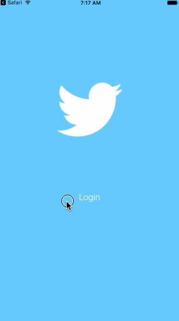

# CodePath-TwitterRedux
This is an iOS application leveraging the Twitter API to display Tweets.

###Time spent: 11 hours

###Completed required user stories:

* [x] Hamburger Menu
* [x] Dragging anywhere in the view should reveal the menu.
* [x] The menu should include links to your profile, the home timeline, and the mentions view.
* [x] Profile page
* [x] Contains the user header view
* [x] Contains a section with the users basic stats: # tweets, # following, # followers
* [x] Shows the user timeline
* [x] Home Timeline: Tapping on a user image should bring up that user's profile page

###Completed optional user stories:

* [ ] Implement the paging view for the user description
* [ ] As the paging view moves, increase the opacity of the background screen. See the actual Twitter app for this effect
* [ ] Pulling down the profile page should blur and resize the header image
* [ ] Long press on tab bar to bring up Account view with animation
* [ ] Tap account to switch to 
* [ ] Include a plus button to Add an Account
* [ ] Swipe to delete an account

